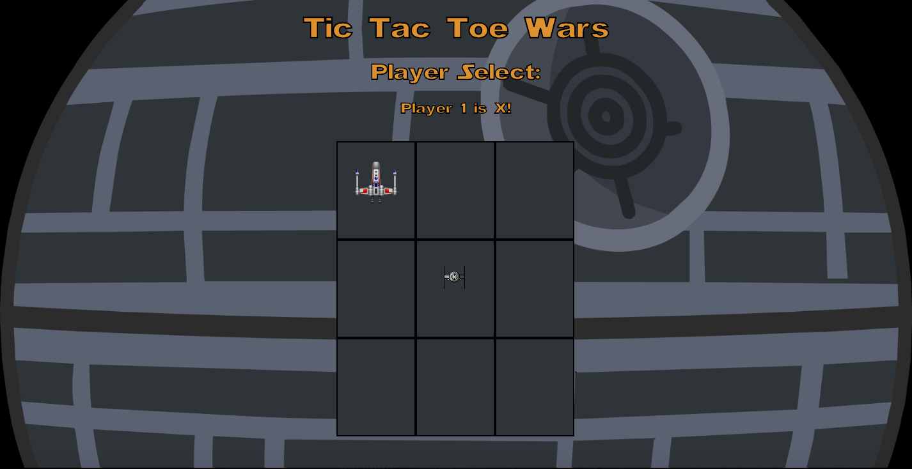
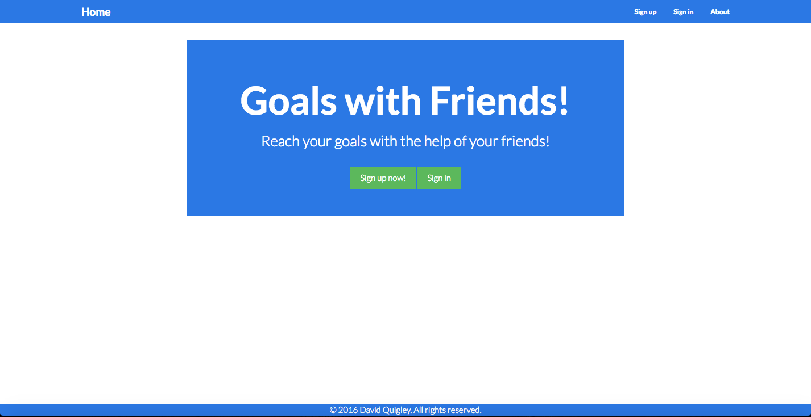
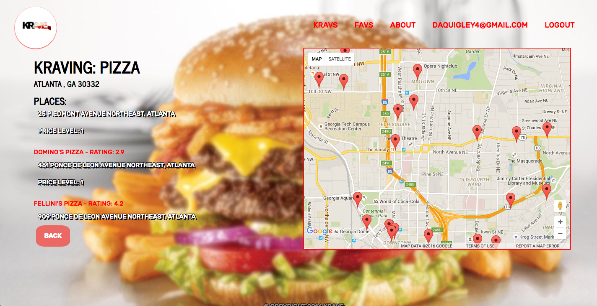
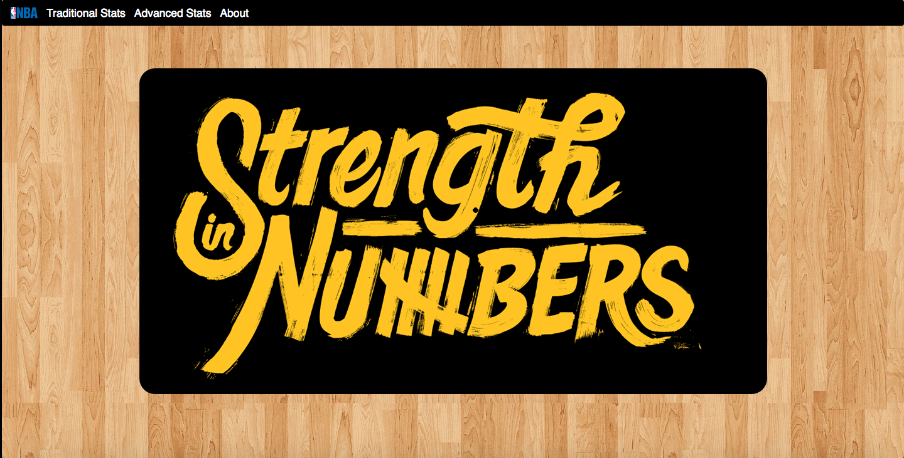

#My Portfolio

##1. Tic Tac Toe Wars

[Tic Tac Toe Wars - application](http://daquigley4.github.io/tic_tac_toe/)

[GitHub: Tic Tac Toe Wars - repository](https://github.com/daquigley4/tic_tac_toe)

Tic Tac Toe Wars is a simple, two player, turn-based strategy game.  The objective is to align 3 alike pieces in the same row, column, or diagonal.  The first player to do so wins the game.

####Technologies Used:
-Languages: HTML5, CSS3, JavaScript, jQuery

-Design: wireframe(balsamiq), Google fonts

-Text Editor: Sublime 3

-Project Management: Trello

##2. Goals with Friends!

[Goals with Friends - application](https://goals-with-friends.herokuapp.com/)

[GitHub: Goals with Friends - repository](https://github.com/daquigley4/goals_with_friends)

A simple web application that can help you and your friends keep each other accountable in pursuit of your goals.

####Technologies Used:
-HTML5, CSS3, Ruby, Ruby on Rails, Bootstrap, SASS, Active Record, Heroku

-Design: wireframe(balsamiq)

-Text Editor: Sublime 3

-Project Management: Trello

##3. Krave.

[Krave. - application](https://krave.herokuapp.com/)

[GitHub: Krave. - repository](https://github.com/HAESOL87/Krave)

A web application built with MongoDB, ExpressJS, and NodeJS that can help you satisfy your Kravings!

####Technologies Used:
- HTML5, CSS3, JavaScript, MongoDB, ExpressJS, NodeJS, Bootstrap, Heroku, mLaB, Google Maps API, Google Places API and Library

- Design: Wireframe(balsamiq), Draw.io

- Text Editor: Sublime 3

- Project Management: Trello

##4. Strength in Numbers

[Strength in Numbers - application](https://strength-in-numbers.herokuapp.com/)

[GitHub: Strength in Numbers - repository](https://github.com/daquigley4/strengthinnumbers)

A web application built with MongoDB, Express.js, Angular.js, Node.js, D3.js, and Angular-nvD3.js that helps you settle bar fights over who the best NBA player is with visualized stats!

####Technologies Used:

HTML5, CSS3, JavaScript, MongoDB, Express.js, Angular.js, Node.js, D3.js, Angular-nvD3.js, Bootstrap, Material Design Lite, Heroku, mLaB

Design: Wireframe(balsamiq), Draw.io

Text Editor: Sublime 3

Project Management: Trello

